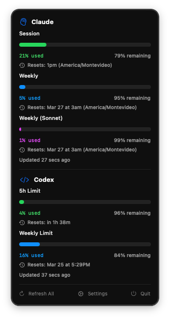

# TokenTap

Multi-provider macOS menu bar app that monitors your AI session usage in real-time. Supports Claude Code and OpenAI Codex, with more providers coming.

  

<p align="center">
  
</p>

## How it works

TokenTap polls your AI provider usage in the background and displays it in your macOS menu bar. Each provider uses its own strategy:

- **Claude Code** — spawns an ephemeral CLI process via PTY, sends `/usage`, and parses the TUI output
- **OpenAI Codex** — makes a minimal API call and reads rate limit data from response headers

No persistent background processes. The menu bar auto-rotates between providers, and clicking shows the full breakdown for all of them.

## Features

- **Multi-provider** — track Claude Code and OpenAI Codex usage simultaneously
- **Menu bar indicator** — fill bar + percentage for the active provider
- **Auto-rotation** — cycles between providers in the menu bar (configurable: 10/20/30s)
- **Detailed dropdown** — click to see all providers with their usage tiers, progress bars, and reset times
- **Auto-refresh** — polls each provider on a configurable interval (1–30 min, default 5 min)
- **Cached data** — last known usage loads instantly on launch
- **Notifications** — macOS alerts when usage crosses configurable thresholds
- **Configurable** — display mode, rotation speed, refresh interval, thresholds, CLI paths
- **Zero dependencies** — native SwiftUI app, only requires CLI tools installed
- **Pluggable architecture** — adding a new provider is one file + one enum case

## Supported Providers

| Provider | CLI Tool | Command | What it tracks |
|----------|----------|---------|----------------|
| Claude Code | `claude` | `/usage` | Session %, Weekly %, Sonnet %, reset times |
| OpenAI Codex | `codex` | `/status` | Usage % remaining |

## Requirements

- macOS 14.0+
- At least one supported CLI tool installed and authenticated:
  - [Claude Code](https://docs.anthropic.com/en/docs/claude-code)
  - [OpenAI Codex](https://github.com/openai/codex)
- Xcode or Swift toolchain (to build from source)

## Install

### Homebrew (recommended)

```bash
brew tap sebasrodriguez/tap
brew install tokentap
```

Then launch:

```bash
open $(brew --prefix)/opt/tokentap/TokenTap.app
```

Optionally link to Applications:

```bash
ln -sf $(brew --prefix)/opt/tokentap/TokenTap.app /Applications/TokenTap.app
```

### Build from source

```bash
git clone https://github.com/sebasrodriguez/claudometer.git
cd claudometer/TokenTap
make install
open TokenTap.app
```

## Usage

Once launched, TokenTap appears in your menu bar with a fill bar and provider usage (e.g. `CL 34%`). With multiple providers, it auto-rotates between them.

**Click** the menu bar item to see all providers:
- **Claude** — Session, Weekly (all models), and Sonnet usage with progress bars and reset times
- **Codex** — Usage percentage with model info

**Settings** (gear icon in dropdown):
- **General** — menu bar style, rotation speed, notification thresholds
- **Claude** — refresh interval, CLI binary path
- **Codex** — refresh interval, CLI binary path

## Architecture

```
┌─────────────────────┐     forkpty() + command      ┌──────────────┐
│  TokenTap           │ ──────────────────────────→  │ CLI process   │
│  (SwiftUI)          │     parse TUI output          │ (ephemeral)  │
│                     │ ←──────────────────────────  │              │
└─────────────────────┘                               └──────────────┘
         │
    ProviderManager
    ├── ProviderState (Claude)
    │   └── ClaudeProvider → ClaudePoller + ClaudeParser
    └── ProviderState (Codex)
        └── CodexProvider → CodexPoller + CodexParser
```

Adding a new provider requires:
1. A `*Provider.swift` implementing the `UsageProvider` protocol
2. A `*Poller.swift` to spawn the CLI and capture output
3. A `*Parser.swift` to extract usage data
4. One case added to `ProviderKind`

## Troubleshooting

**"CLI not found"** — Make sure the CLI tool is installed and on your PATH. You can set paths manually in Settings per provider.

**No data on first launch** — The first poll takes ~10-15 seconds per provider. Subsequent launches show cached data immediately.

**Stale data** — Click "Refresh All" in the dropdown to force a fresh poll.

## License

MIT
